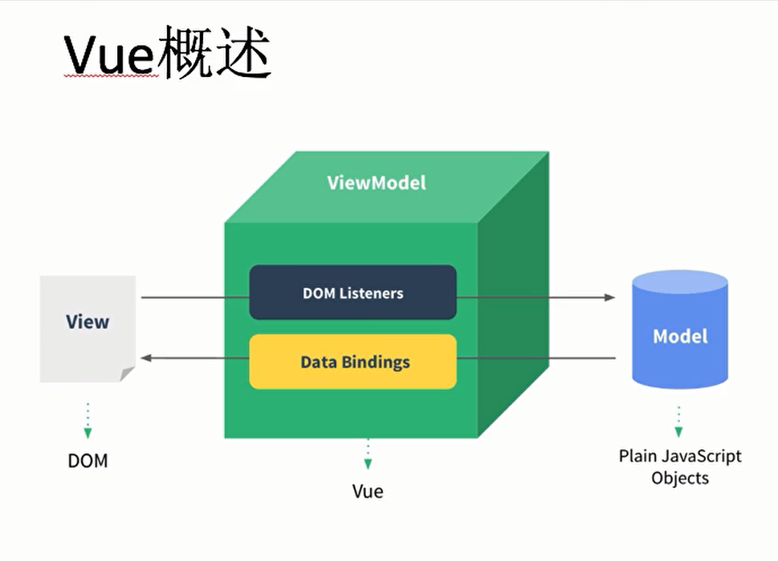

# 软件设计模式

## MVC
Model View Controller

## MVVM
Model-View-ViewModel

## 双向数据绑定

# vue基础语法
* v-text / v-html
* v-if  / v-else
* v-show 比重新渲染快
* v-for(value,key,index) //键+值+索引
* sort
* computed 计算属性
* v-on
* v-model:双向数据绑定的特殊指令

